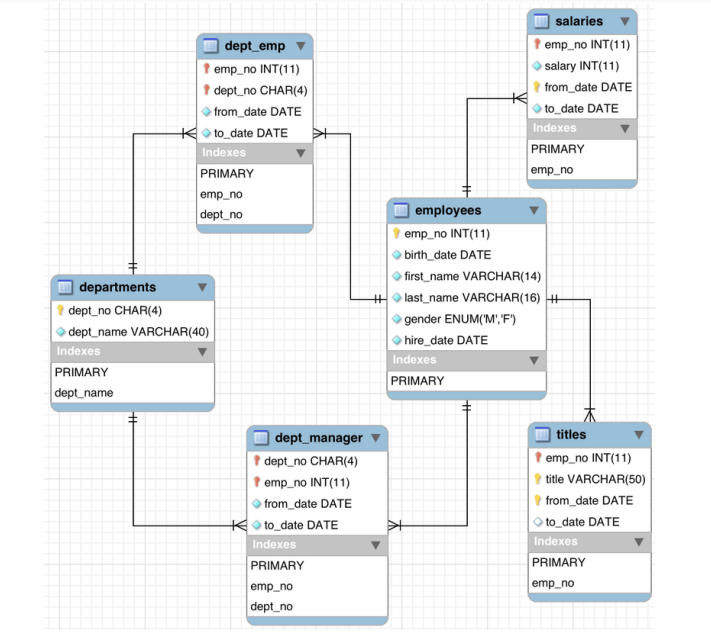

# MySQLProject: Employee Database Queries

This project includes SQL queries created to explore and analyze a sample employee database (`employees`). The queries are developed and executed using **IntelliJ IDEA** and the MySQL database engine.

## 💼 Database Overview

The schema `employees` includes:

- `employees`: Employee records (ID, name, gender, birth date, hire date).
- `departments`: Department codes and names.
- `dept_emp`: Department assignment history of employees.
- `dept_manager`: Department managers.
- `salaries`: Salary history of employees.
- `titles`: Job titles held by employees.

---



## 📁 Project Structure

```

MySQLProject/
│
├── queries/
│   └── query01.sql - query20.sql   # SQL files for each task
├── configuration.properties        # Configuration file for database connection
├── README.md
└── employees-schema.png            # Database schema image
````

---

## ✅ SQL Tasks 1–20

### 🔹 Task 1 - List all employees in department D001
-   List all employees in department D001.

```sql
select e.emp_no, e.first_name, e.last_name, d.dept_name
from employees.employees e
join employees.dept_emp de on e.emp_no=de.emp_no
join employees.departments d on de.dept_no=d.dept_no
where d.dept_no='d001';';
```

---

### 🔹 Task 2 - List all employees in 'Human Resources' department
-   List all employees in 'Human Resources' department.

```sql
select e.emp_no, e.first_name, e.last_name, d.dept_name
from employees.employees e
join employees.dept_emp de on e.emp_no=de.emp_no
join employees.departments d on de.dept_no=d.dept_no
where d.dept_no='d003';
```

---

### 🔹 Task 3 - Calculate the average salary of all employees
-   Calculate the average salary of all employees

```sql
select avg(salary) as averageSalary from employees.salaries;
```

---

### 🔹 Task 4 - Calculate the average salary for male employees
-   Calculate the average salary of all employees with gender "M"

```sql
select avg(s.salary) as averageSalaryMan from employees.employees e
join employees.salaries s on e.emp_no=s.emp_no
where e.gender='M';
```

---

### 🔹 Task 5 - Calculate the average salary for female employees
-   Calculate the average salary of all employees with gender "F"

```sql
select avg(s.salary) as averageSalaryWomen from employees.employees e
join employees.salaries s on e.emp_no=s.emp_no
where e.gender='F';
```

---

### 🔹 Task 6 - List Sales department employees with salary > 70,000
-   List all employees in the "Sales" department with a salary greater than 70,000.

```sql
select e.emp_no, e.first_name, e.last_name, d.dept_name, s.salary
from employees.employees e
join employees.dept_emp de on e.emp_no=de.emp_no
join employees.departments d on de.dept_no=d.dept_no
join employees.salaries s on e.emp_no=s.emp_no
where d.dept_no='d007' and s.salary>70000;
```

---

### 🔹 Task 7 - List employees with salaries between 50,000 and 100,000
-   This query retrieves employees who have salaries between 50000 and 100000.

```sql
select e.emp_no, e.first_name, e.last_name, d.dept_name, s.salary
from employees.employees e
join employees.dept_emp de on e.emp_no=de.emp_no
join employees.departments d on de.dept_no=d.dept_no
join employees.salaries s on e.emp_no=s.emp_no
where s.salary between 50000 and 100000;
```

---

### 🔹 Task 8 - Calculate average salary per department (by dept\_no)
-   Calculate the average salary for each department (by department number or department name)

```sql
select d.dept_no, avg(s.salary) as averageSalary from employees.salaries s
join employees.dept_emp de on s.emp_no=de.emp_no
join employees.departments d on de.dept_no=d.dept_no
group by d.dept_no;
```

---

### 🔹 Task 9 - Calculate average salary per department (with names)
-   Calculate the average salary for each department, including department names

```sql
select d.dept_name, avg(s.salary) as averageSalary from employees.salaries s
join employees.dept_emp de on s.emp_no=de.emp_no
join employees.departments d on de.dept_no=d.dept_no
group by d.dept_name;
```

---

### 🔹 Task 10 - Show all salary changes of employee 10102
-   Find all salary changes for employee with emp. no '10102'

```sql
select e.first_name, e.last_name, s.salary from employees.salaries s
join employees.employees e on e.emp_no= s.emp_no
where e.emp_no='10102';
```

---

### 🔹 Task 11 - Show salary increases for employee 10102
-   Find the salary increases for employee with employee number '10102' (using
-- the to_date column in salaries)

```sql
select first_name, last_name, salary, to_date from employees.salaries s
join employees.employees e on e.emp_no= s.emp_no
where e.emp_no='10102'
order by to_date asc;
```

---

### 🔹 Task 12 - Find the employee with the highest salary
-   Find the employee with the highest salary

```sql
select e.first_name, e.last_name, s.salary from employees.salaries s
join employees.employees e on e.emp_no= s.emp_no
order by s.salary desc
limit 1;
```

---

### 🔹 Task 13 - Find latest salary for each employee
-   Find the latest salaries for each employee

```sql
SELECT e.emp_no, e.first_name, e.last_name, s.salary, s.from_date
FROM employees e
JOIN salaries s ON e.emp_no = s.emp_no
JOIN (
    SELECT emp_no, MAX(from_date) AS latest_date
    FROM salaries
    GROUP BY emp_no
) latest_s ON s.emp_no = latest_s.emp_no AND s.from_date = latest_s.latest_date;
```

---

### 🔹 Task 14 - Top earner in Sales department
-   List the first name, last name, and highest salary of employees in the "Sales" department.
    Order the list by highest salary descending and only show the employee with the highest salary.

```sql
select e.first_name, e.last_name, max(salary) from employees.employees e
join employees.dept_emp de on e.emp_no = de.emp_no
join employees.departments d on de.dept_no = d.dept_no
join employees.salaries s on e.emp_no = s.emp_no
where d.dept_name = 'Sales'
group by e.emp_no
order by max(salary) desc limit 1;
```

---

### 🔹 Task 15 - Highest average salary in Research department
-   Find the Employee with the Highest Salary Average in the Research Department

```sql
select e.first_name, e.last_name, avg(s.salary) from employees.employees e
join employees.dept_emp de on e.emp_no = de.emp_no
join employees.departments d on de.dept_no = d.dept_no
join employees.salaries s on e.emp_no = s.emp_no
where d.dept_name = 'Research'
group by e.emp_no
order by avg(s.salary) desc limit 1;
```

---

### 🔹 Task 16 - Top single salary per department
-   For each department, identify the employee with the highest single salary ever recorded. List the
    department name, employee's first name, last name, and the peak salary amount. Order the results
    by the peak salary in descending order.

```sql
select d.dept_name, e.first_name, e.last_name, s.salary
from salaries s
join employees e on s.emp_no = e.emp_no
join dept_emp de on e.emp_no = de.emp_no
join departments d on de.dept_no = d.dept_no
join (select de.dept_no, max(s.salary) as max_salary
    from salaries s
    join dept_emp de on s.emp_no = de.emp_no
    group by de.dept_no) as max_salaries
on de.dept_no = max_salaries.dept_no and s.salary = max_salaries.max_salary
order by s.salary desc;
```

---

### 🔹 Task 17 - Highest average salary employee per department
-   Identify the employees in each department who have the highest average salary. List the
    department name, employee's first name, last name, and the average salary. Order the results by
    average salary in descending order, showing only those with the highest average salary within their
    department.

```sql
SELECT
    d.dept_name AS department,
    e.first_name,
    e.last_name,
    AVG(s.salary) AS avg_salary
FROM employees e
INNER JOIN dept_emp de ON e.emp_no = de.emp_no
INNER JOIN departments d ON de.dept_no = d.dept_no
INNER JOIN salaries s ON e.emp_no = s.emp_no
GROUP BY d.dept_name, e.emp_no, e.first_name, e.last_name
ORDER BY avg_salary DESC;
```

---

### 🔹 Task 18 - List employees hired before 1990-01-01
-   List the names, last names, and hire dates in alphabetical order of all employees hired before
    January 01, 1990.

```sql
select first_name, last_name, hire_date from employees.employees
where hire_date < '1990-01-01'
order by first_name, last_name;
```

---

### 🔹 Task 19 - List employees hired between 1985 and 1989

- List the names, last names, hire dates of all employees hired between January 01, 1985 and
  December 31, 1989, sorted by hire date.

```sql
select first_name, last_name, hire_date from employees.employees
where hire_date between '1985-01-01' and '1989-12-31'
order by hire_date;
```

---

### 🔹 Task 20 - Sales employees hired 1985–1989, sorted by salary

- List the names, last names, hire dates, and salaries of all employees in the Sales department who
  were hired between January 01, 1985 and December 31, 1989, sorted by salary in descending order.

```sql
select e.first_name, e.last_name, e.hire_date, s.salary from employees.employees e
join dept_emp de on e.emp_no = de.emp_no
join departments d on de.dept_no = d.dept_no
join employees.salaries s on e.emp_no = s.emp_no
where hire_date between '1985-01-01' and '1989-12-31'
and d.dept_name = 'Sales'
order by s.salary desc;
```

---

## 🛠️ How to Use

> 💡Connect to your MySQL server using IntelliJ Database Tools:
> The confidentiality of access information is stored in the configuration file.

* Host: ``
* Port: ``
* Schema: ``
* Username: ``
* Password: ``

Run each query file individually or use `query.sql` to execute all tasks in bulk.

---

**Contributors:**

* [Zafer Ataklı](https://github.com/zaferatakli)
* [Rıfat Batır](https://github.com/rftbtr)
* [Tugba Kilic](https://github.com/TugbaKilic33)
* [Nuri Öztürk](https://github.com/NuriOzturk)
* [Azim Korkmaz](https://github.com/AzimKorkmaz)
* [Yigit Cam](https://github.com/Yigit-Cam)
* [Eren Ozbebek](https://github.com/theeren123)